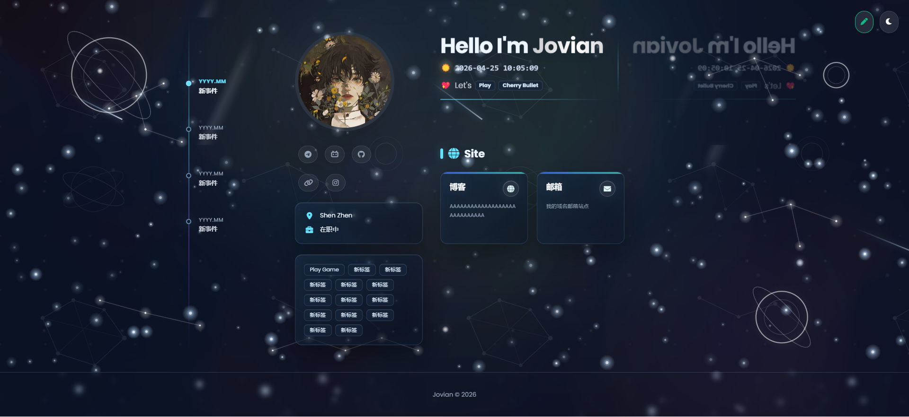
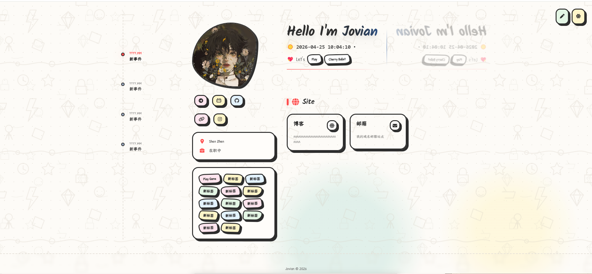
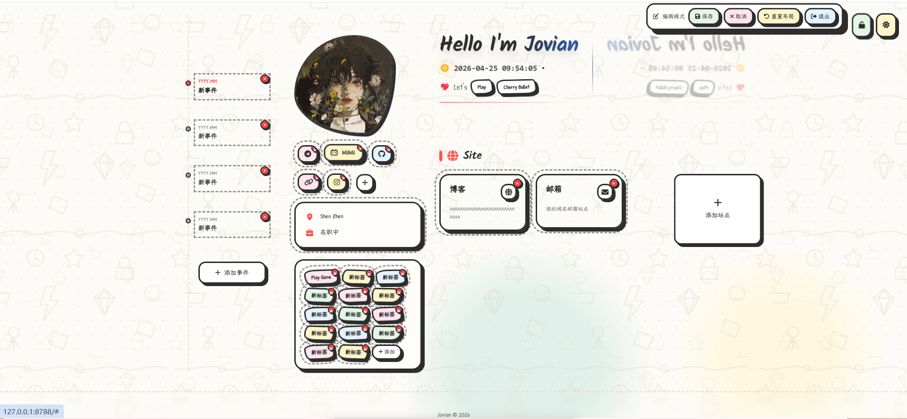

# Jovian's Homepage

<p align="center">
  
</p>

<p align="center">
  <strong>一个可在线编辑、支持主题切换与 Cloudflare Pages 部署的个人主页模板。</strong>
</p>

<p align="center">
  <a href="https://github.com/SHIJIU6/Jovian-s-Homepage">GitHub</a>
  ·
  <a href="#快速开始">快速开始</a>
  ·
  <a href="#部署指南">部署指南</a>
  ·
  <a href="#项目规划">项目规划</a>
</p>

## 项目简介

Jovian's Homepage 是一个面向个人主页、导航页和轻量作品集场景的开源前端项目。项目采用静态页面 + Cloudflare Pages Functions 的方式构建，默认提供个人信息、社交链接、时间线、标签、站点卡片、主题切换、后台编辑、图片上传和远端配置持久化能力。

项目适合用于：

- 个人主页 / About Me 页面
- 个人导航站 / 资源收藏页
- 作品集入口 / 博客入口
- 可视化编辑的 Cloudflare Pages 静态站点模板

## 功能特性

- **双主题界面**：内置深色玻璃拟态与手绘风格主题，并支持一键切换。
- **在线编辑模式**：通过管理员密码登录后，可编辑时间线、标签、站点卡片、社交链接等内容。
- **远端配置存储**：站点配置保存到 Cloudflare KV，前端读取 `/api/config` 自动渲染。
- **图片上传能力**：头像、背景、站点图标、社交图标可上传至 Cloudflare R2。
- **响应式布局**：适配桌面端、平板和移动端，社交链接长文本支持自适应换行展示。
- **构建产物分离**：源码位于 `src/`，构建产物输出到 `public/assets/`，便于部署和缓存管理。
- **边缘部署友好**：基于 Cloudflare Pages + Functions + KV + R2，无需传统服务器。

## 示例截图

> 当前仓库未附带专门的截图目录。你可以运行本地开发服务后截图，并将图片放入 `docs/screenshots/` 或 GitHub Issue/Release 中，再替换下面的占位路径。

| 深色主题 | 手绘主题 | 编辑模式 |
| --- | --- | --- |
|  |  |  |

## 技术栈

| 分类 | 技术 |
| --- | --- |
| 前端 | HTML、CSS、JavaScript ES Modules |
| 样式 | Tailwind CSS、Custom CSS、Font Awesome |
| 构建 | Node.js、esbuild、PostCSS、Tailwind CSS |
| 部署 | Cloudflare Pages |
| Serverless API | Cloudflare Pages Functions |
| 数据存储 | Cloudflare KV |
| 图片存储 | Cloudflare R2 |
| 本地开发 | Wrangler |

## 目录结构

```text
.
├── functions/              # Cloudflare Pages Functions API
│   └── api/
│       ├── auth.js         # 管理员登录与 token 生成
│       ├── config.js       # 站点配置读取与保存
│       ├── upload.js       # 图片上传到 R2
│       └── images/         # R2 图片读取接口
├── public/                 # Cloudflare Pages 静态目录
│   ├── index.html          # 页面模板
│   ├── custom.css          # 项目自定义样式
│   ├── Background.webp     # 默认背景图
│   ├── touxiang.jpg        # 默认头像
│   └── assets/             # 构建输出目录，已 gitignore
├── scripts/
│   └── build-assets.mjs    # 构建 CSS 与 JS 产物
├── shared/
│   └── site-config.js      # 默认配置与配置规范化逻辑
├── src/
│   ├── app.js              # 前端入口
│   ├── auth.js             # 前端登录状态
│   ├── config.js           # 配置请求封装
│   ├── editor.js           # 编辑模式逻辑
│   ├── layout.js           # 可拖拽/布局逻辑
│   ├── render.js           # 页面渲染逻辑
│   ├── cosmic-background.js# 背景动效
│   └── tailwind.css        # Tailwind 输入文件
├── package.json
├── tailwind.config.js
├── postcss.config.cjs
└── wrangler.toml           # Cloudflare 资源绑定配置
```

## 快速开始

### 环境要求

- Node.js 18 或更高版本
- npm 9 或更高版本
- Cloudflare 账号（仅部署或使用 KV/R2 时需要）
- Wrangler CLI（项目已作为开发依赖安装，可通过 `npx wrangler` 使用）

### 安装依赖

```bash
npm install
```

### 构建静态资源

```bash
npm run build
```

构建完成后会生成：

- `public/assets/styles.css`
- `public/assets/app.js`

`public/assets/` 是构建产物目录，默认不会提交到 Git。

### 本地开发

```bash
npm run dev
```

该命令会先执行构建，然后通过 Wrangler 启动 Cloudflare Pages 本地开发服务。

如果你只想预览静态页面，也可以先执行：

```bash
npm run build
```

再使用任意静态服务器托管 `public/` 目录。但完整的登录、保存配置和图片上传能力需要 Wrangler 与 KV/R2 绑定。

## 环境变量

本地开发可创建 `.dev.vars`：

```env
ADMIN_PASSWORD=your-strong-password
```

生产环境请在 Cloudflare Dashboard 中配置：

| 变量名 | 必填 | 说明 |
| --- | --- | --- |
| `ADMIN_PASSWORD` | 是 | 管理员登录密码，用于进入编辑模式并保存配置 |

> `.dev.vars` 已加入 `.gitignore`，不要提交真实密码、token 或密钥。

## Cloudflare 资源配置

### 1. 创建 KV 命名空间

```bash
npm run kv:create
```

该命令会创建：

- `SITE_CONFIG`：保存主页配置
- `AUTH_TOKENS`：保存管理员登录 token

创建后，将 Cloudflare 返回的 namespace id 写入 `wrangler.toml`：

```toml
[[kv_namespaces]]
binding = "SITE_CONFIG"
id = "YOUR_SITE_CONFIG_KV_ID"

[[kv_namespaces]]
binding = "AUTH_TOKENS"
id = "YOUR_AUTH_TOKENS_KV_ID"
```

### 2. 创建 R2 Bucket

```bash
npm run r2:create
```

默认 bucket 名称为：

```toml
[[r2_buckets]]
binding = "IMAGES"
bucket_name = "javian-images"
```

如需改名，请同步修改 `wrangler.toml` 和 Cloudflare 资源配置。

## 部署指南

### 方式一：Cloudflare Pages Git 集成（推荐）

1. Fork 或克隆本仓库。
2. 登录 Cloudflare Dashboard。
3. 进入 `Workers & Pages`，选择 `Create application`。
4. 选择 `Pages`，连接 GitHub 仓库。
5. 设置构建参数：

| 配置项 | 值 |
| --- | --- |
| Framework preset | None / 无框架 |
| Build command | `npm run build` |
| Build output directory | `public` |
| Root directory | `/` |

6. 在 Pages 项目中绑定 KV 和 R2：
   - `SITE_CONFIG` → Cloudflare KV namespace
   - `AUTH_TOKENS` → Cloudflare KV namespace
   - `IMAGES` → Cloudflare R2 bucket
7. 在 `Settings > Environment variables` 中添加 `ADMIN_PASSWORD`。
8. 重新部署项目。

### 方式二：Wrangler 命令行部署

先登录 Cloudflare：

```bash
npx wrangler login
```

构建并部署：

```bash
npm run deploy
```

## 使用说明

### 进入编辑模式

1. 打开站点页面。
2. 点击右上角编辑按钮。
3. 输入 `ADMIN_PASSWORD`。
4. 登录成功后可编辑页面模块。
5. 点击保存后，配置会写入 Cloudflare KV。

### 可编辑内容

- 时间线事件
- 个人标签
- 社交链接
- 站点 / 项目卡片
- 头像、背景图、站点图标和社交图标
- 部分布局位置与模块显示状态

### API 简介

| 路径 | 方法 | 说明 |
| --- | --- | --- |
| `/api/auth` | `POST` | 校验管理员密码并返回 token |
| `/api/config` | `GET` | 获取站点配置 |
| `/api/config` | `POST` | 保存站点配置，需要认证 |
| `/api/upload` | `POST` | 上传图片到 R2，需要认证 |
| `/api/images/:filename` | `GET` | 读取 R2 图片资源 |

## 自定义指南

### 修改默认内容

默认配置位于：

```text
shared/site-config.js
```

你可以在其中调整默认时间线、站点卡片、标签和社交链接。

### 修改页面结构

页面 HTML 位于：

```text
public/index.html
```

主要渲染容器包括：

- `#timelineItems`
- `#socialLinksContainer`
- `#tagsContainer`
- `#sitesContainer`

### 修改样式主题

自定义样式位于：

```text
public/custom.css
```

Tailwind 输入文件位于：

```text
src/tailwind.css
```

修改后执行：

```bash
npm run build
```

### 修改前端逻辑

主要源码位于：

```text
src/
```

常见修改入口：

- `src/render.js`：调整渲染结构
- `src/editor.js`：调整编辑模式
- `src/layout.js`：调整布局行为
- `src/config.js`：调整配置请求
- `src/app.js`：调整应用初始化

## 开源前准备清单

提交或公开仓库前建议确认：

- [ ] `.dev.vars`、`.env`、token、密码等敏感信息未提交。
- [ ] `node_modules/`、`.wrangler/`、`public/assets/` 未提交。
- [ ] 本地工具目录如 `.ace-tool/`、`.spec-workflow/` 未提交。
- [ ] `wrangler.toml` 中的 KV id 已按需要替换，或保留占位值供使用者配置。
- [ ] README 中的截图路径已替换为真实截图。
- [ ] 生产环境已配置 `ADMIN_PASSWORD`。

## 项目规划

### 已完成

- [x] 静态主页基础结构
- [x] 深色与手绘双主题
- [x] Cloudflare Pages Functions API
- [x] KV 配置持久化
- [x] R2 图片上传与读取
- [x] 管理员登录与编辑模式
- [x] 社交链接长文本自适应换行
- [x] 构建资源与源码目录分离

### 近期计划

- [ ] 提供默认截图与在线演示地址
- [ ] 增加配置导入 / 导出功能
- [ ] 增加更多主题预设
- [ ] 优化移动端编辑体验
- [ ] 增加基础端到端测试

### 长期计划

- [ ] 支持多语言内容配置
- [ ] 支持更多社交平台图标预设
- [ ] 支持组件级主题配置
- [ ] 提供一键初始化 Cloudflare 资源脚本
- [ ] 提供 Docker / 本地 mock API 开发模式

## 常见问题

### 为什么 `public/assets/` 没有提交？

`public/assets/` 是构建产物目录，由 `npm run build` 自动生成。开源项目通常只提交源码，避免构建产物造成冲突和冗余。

### 本地开发登录失败怎么办？

请确认：

1. `.dev.vars` 中已设置 `ADMIN_PASSWORD`。
2. 使用 `npm run dev` 启动，而不是直接打开 HTML 文件。
3. Wrangler 本地服务已正确绑定 KV。

### 部署后保存失败怎么办？

请确认 Cloudflare Pages 项目已绑定：

- `SITE_CONFIG` KV
- `AUTH_TOKENS` KV
- `IMAGES` R2 bucket
- `ADMIN_PASSWORD` 环境变量

### 图片上传失败怎么办？

请检查：

- R2 bucket 是否已创建并绑定为 `IMAGES`。
- 上传文件类型是否为 JPEG、PNG、WebP 或 GIF。
- 文件大小是否小于 5MB。
- 当前是否已登录编辑模式。

## 贡献指南

欢迎提交 Issue 和 Pull Request。建议流程：

1. Fork 本仓库。
2. 创建功能分支：`git checkout -b feat/your-feature`。
3. 安装依赖并验证构建：`npm install && npm run build`。
4. 提交改动并描述清楚动机与影响范围。
5. 发起 Pull Request。

提交信息建议遵循 Conventional Commits：

```text
feat: 添加新的主页模块
fix: 修复社交链接换行问题
docs: 完善部署文档
refactor: 重构配置规范化逻辑
```

## 许可证

本项目基于 GNU General Public License v3.0（GPL-3.0）开源，详见 [LICENSE](LICENSE)。

这意味着你可以自由使用、复制、修改和分发本项目，但如果你分发修改后的版本或基于本项目的衍生作品，也需要继续以 GPL-3.0 兼容协议开源，并保留相应的版权与许可证声明。

## 致谢

- [Cloudflare Pages](https://pages.cloudflare.com/)
- [Cloudflare Workers KV](https://developers.cloudflare.com/kv/)
- [Cloudflare R2](https://developers.cloudflare.com/r2/)
- [Tailwind CSS](https://tailwindcss.com/)
- [esbuild](https://esbuild.github.io/)
- [Font Awesome](https://fontawesome.com/)

